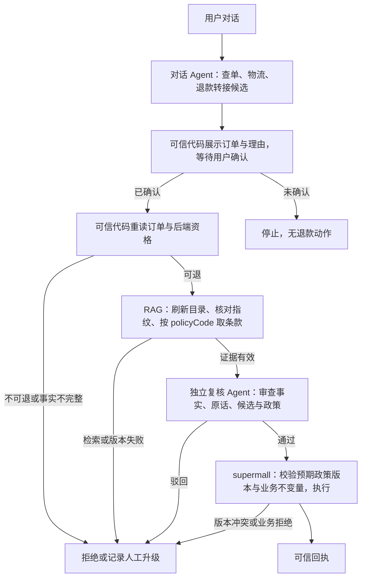

# 阶段 3：确定性退款编排与 RAG 政策复核设计

> 2026-09-26。接续已验收的计划 A/B/C Task 1–6。本设计取代同日《售后 RAG 解释层设计》作为阶段 3 的实施基线；旧文档保留为方案变更记录。用户已确认：原决策 Agent 继续负责对话、查单和物流；用户在对话中明确要求退款时转接退款流程。退款流程由可信代码编排，政策 RAG 进入独立复核 Agent，但不能推翻后端的不可退结论。

## 目标与边界

本项目是能执行真实退款的求职作品集。阶段 3 展示四件事：自然语言售后对话可转接明确的退款申请；退款资格、金额、幂等与写入仍由 supermall 掌握；与后端同源的政策目录经检索进入独立复核，能够阻止自动退款；复核驳回时当轮说明可核实的原因。政策变化须被消费者检测、重建索引并在版本不一致时停止自动退款。

对退款请求，只有一个拥有审批职责的模型角色：RAG 复核 Agent。原决策 Agent 继续处理普通对话和只读查询，在退款路径上仅产生转接候选，不判断资格、金额或是否执行。可信编排代码负责确认用户意图、读取事实、准入检查、政策检索、复核调用、人工升级与最终提交。所有后端访问沿用用户 JWT，经独立 MCP Server；Agent 不直连数据库，也不持有商家或后端密钥。

阶段 3 同时**新增** FAQ 与当前演示商品的资料问答；目前代码里没有这两类语料与商品 MCP 工具。FAQ 和商品说明只用于解释，不能成为退款审批依据。商品说明只代表当前目录，不冒称下单时的描述。语料目标为三条动态权威政策、32 条原创 FAQ、15–35 条原创且当前上架的演示商品说明；不拆分三条政策来凑数量。

## 现有契约与变更点

- supermall 的政策端点返回同次不可变目录快照及小写 SHA-256 指纹，覆盖 code、title、clauseText 和条款顺序；MCP 的 `list_policy_clauses` 返回单层 `{fingerprint, clauses}`。指纹表明所用目录版本，不证明政策文字与执行规则在语义上相符。
- `get_refund_eligibility` 现有 `eligible`、`reason`、`policyCode`、`refundableAmount`、`refundExists` 等字段。阶段 3 增量加入 `catalogFingerprint`；资格服务与目录端点调用同一个目录构造入口，不复制哈希算法。后端不可退或已有退款时，可信代码直接终止自动退款，不能让 RAG 或复核 Agent 改判。
- 现有 Agent CLI 把每行原话交给决策 Agent，`request_refund` 是其本地工具；现有复核上下文重读订单与资格，但资格布尔门槛主要写在复核提示词里。本阶段把资格、已有退款、订单 ID 与金额一致性校验移到可信编排代码，复核模型的结论只可增加拒绝或人工核实门槛。
- `submit_refund` 仍只由可信执行器在复核通过后调用。为防复核与写入之间政策版本切换，本阶段给可信执行器、MCP 工具与 supermall 写端点增量传入本次复核的 `expectedCatalogFingerprint`；新 Agent 路径的 MCP 工具将其列为必填。supermall 的现有直接 HTTP 路径保留 reason-only 兼容，收到预期指纹时才应用版本前置条件；因此“RAG 必经”只声称适用于本 Agent 的退款路径，不声称所有后端客户端都经过 RAG。后端执行事务先识别已有退款并保留原有幂等回执；只有将创建**新退款记录**时，才用与资格判定相同的政策目录入口核对当前指纹，不一致则在写入前拒绝并转人工。唯一索引冲突后读取赢家的幂等路径也保持原语义。不能仅由 Agent 在调用前再读一次目录代替写端校验。后端仍再次校验所有权、状态、金额和幂等性；调用错误或超时沿用“结果无法确认”的安全回执，不推断成功或失败。
- 原设计基线第 4.1 节的“RAG 只用于解释”及第 7.1 节的“决策 Agent 发起带执行含义的退款申请”仅适用于已完成的计划 C；阶段 3 按本文调整。历史计划 A/B/C 的已验收结果不回写成未完成。

## 对话转接与确定性退款入口

决策 Agent 保留普通对话、查单、物流等既有能力。阶段 3 必须从其工具集中**移除现有 `request_refund`**，并移除政策目录和直接退款资格 MCP 工具；模型只见查单/物流只读工具、人工升级工具，以及无写入能力的退款转接、资格询问与资料解释标记工具。这些标记只记录请求并返回固定确认语，不把资格或检索内容交给对话模型。用户只问“能不能退”而未申请时，资格询问由可信代码按用户身份重读后用固定模板答复，不进入复核或写入。遇到明确退款诉求时，决策 Agent 通过转接工具输出候选订单 ID 与用户理由；工具不调用复核或后端写入，也不把政策语料返回给决策 Agent。可信代码保存本轮原始用户表述，模型候选仅供展示。若本轮没有明确且唯一的订单 ID，可信代码经用户身份列出可选订单或要求用户输入订单号；不得从模型的会话记忆或“刚才查过”推断唯一订单。多订单、指向不明或理由缺失时先请用户澄清。

模型的转接候选不是授权。可信代码展示**经用户选择或输入的订单 ID**与拟提交理由，要求用户以明确的确认动作继续；CLI 可使用固定确认命令，其他界面可使用确认按钮。确认必须绑定候选订单 ID、理由与当前会话，不能由模型代发；候选改变或会话切换后重新确认。确认后构造 `RefundRequest(orderId, reason, originalUserRequest)`，此后退款流程不再依赖决策 Agent 的答复或推理。这个确认也覆盖用户在多轮对话中用“这单”指代历史订单的情况。

每个确认请求以同一用户 JWT 重新调用 `get_order` 和 `get_refund_eligibility`，校验 MCP 成功、JSON 结构、返回订单 ID 与目标一致、资格关键字段类型和值，以及订单实付金额与资格可退金额一致。`eligible != true`、`refundExists != false`、订单状态不允许退款、金额不一致、事实缺失或查询失败均不得进入复核或执行；可说明后端给出的原因，无法确认事实时记录人工升级。原始用户表述与确认记录保留到复核上下文，不以决策 Agent 的摘要替代。

## RAG 政策复核

可信代码在每次准备复核时调用 `list_policy_clauses`。它校验 MCP 响应、非空指纹、唯一政策 code、非空标题与正文，并从同一次响应构建不可变候选索引。刷新串行化，指纹变化时完整构建后原子切换 `{fingerprint, documents, retrievalIndex}`；每次复核固定一个代次。目录拉取或构建失败、资格 `catalogFingerprint` 与目录指纹不一致、`policyCode` 缺失或找不到准确条款时，停止自动退款并记录人工升级；不能用旧缓存、FAQ 或相似条款补位。

政策检索按资格响应中的 `policyCode` 精确取条款，不使用向量相似度决定适用政策。可信编排层将原始用户表述、确认后的候选动作、重新读取的订单和资格事实、目录指纹、匹配的政策 code 与原文送给独立复核 Agent。复核 Agent 没有任何工具，也看不到决策 Agent 的思维链、摘要或会话记忆；政策正文被视为待核对的数据，其中的指令不能改变复核规则。

复核 Agent 输出结构化 `approved`、问题类别和引用的政策 code；通过时问题列表必须为空，驳回时列出风险或事实冲突。可信代码检查输出结构、引用 code 与当前匹配条款一致、订单和资格硬门槛仍成立。空结论、模型异常、格式错误、引用无效或结论自相矛盾均按驳回并转人工处理。复核能够因用户诱导、请求与事实或政策不符等问题否决候选申请；它不能把后端不可退改成可退，也不能自定金额。复核通过后，可信执行器才携带 `expectedCatalogFingerprint` 调用 `submit_refund`；写端版本冲突按未执行且需人工核实处理。

同一会话同一订单一旦复核驳回，保持既有终止规则：后续补充材料也不再自动送审或执行，只返回已记录的人工升级状态。人工升级只写入现有会话记录和日志；对用户应说“已记录，请联系人工客服”，不承诺主动联系或处理时限。

## 回复与资料问答

不可退时当轮给出后端资格原因；只有资格与当前目录指纹一致且 code 匹配时，才可附政策原文。复核驳回时，可信代码先核对问题类别所依据的订单、资格、原始用户表述或政策引用，再用固定模板说明可核实的原因；无法可靠核对时只说明需要人工核实，不原样转发模型自由文本。**转接候选、待确认、拒绝、升级、执行结果或执行不确定的回复均由可信编排层覆盖决策 Agent 的自然语言输出**；未确认时绝不能声称已退款。执行结果只取可信后端回执，解释不能改写退款状态、金额或执行是否完成。

FAQ 与当前演示商品问答需新建只读检索和无动作工具的解释生成器。32 条原创 FAQ 在仓库内逐条维护稳定 ID、标题、正文、可核对的事实依据与复核日期；不能新增或改写退款窗口、金额、质量核验等规则。15–35 条原创演示商品经商家业务 API 创建并上架，实际商品 ID 写入被 Git 忽略的环境清单；新增的只读 MCP 列表/详情工具只让检索器索引清单内当前上架商品。列表逐页读取，每次问答以当前内容摘要刷新商品子索引，引用前再次查询详情和上架状态；失败或下架时不引用缓存描述。

对话 Agent 遇到政策、FAQ 或商品问题时只提出资料解释请求；可信代码在没有退款或升级动作的轮次才检索资料。FAQ/商品检索以原始用户输入排名，返回带来源 ID 的片段；无工具生成器只能拟写非交易补充说明。来源 ID 不在候选集中、格式不合格、出现当前订单资格、金额、到账或退款完成结论，或生成失败时，整段生成文本丢弃，改用代码引用来源原文或说明无可靠依据。当前商品描述不能被当作历史订单承诺；关于“收到的商品是否符合下单时描述”，只说明无法由当前目录核定并指向人工核查。一般政策问题可列示当前目录至多三条原文，但必须说明不能据此判断具体订单。

政策检索可用性现在会影响**自动退款复核**：失败时转人工，不影响后端自身的资格与写入规则。FAQ 或商品资料不可用只影响相应问答。日志只记录无凭据的政策指纹、代次、引用 code、转接/复核/执行状态及降级原因；不记录 JWT、模型密钥、原始用户话语或订单号到既有通用 trace。阶段 4 再定义按订单绑定的持久评测证据。

## 验收

1. 入口测试证明决策 Agent 仍能完成普通对话、查单和物流；可见工具集中没有旧 `request_refund`、`submit_refund`、政策目录或直接退款资格 MCP 工具，转接工具没有执行能力。只问资格时由可信代码答复且不调用复核；模型误触发、订单不明确、用户未确认、确认订单或理由与候选不一致时，复核和 `submit_refund` 调用次数均为零；这些轮次以及复核驳回、执行不确定轮次的最终回复由可信模板覆盖模型输出，不出现“已退款”的假回执。
2. 硬门槛测试覆盖后端不可退、已有退款、订单 ID 不符、状态或金额不一致、缺字段、非法 JSON 和 MCP 失败；任何复核模型输出都不能绕过这些门槛。独立复核的模型请求工具列表为空。
3. 索引测试覆盖条款内容与顺序变化、指纹切换、构建失败不引用旧代次、资格指纹不匹配、未知/重复 code、恶意政策文本；政策检索失败或不一致时无自动退款，FAQ/商品文本无法进入复核上下文。模拟复核完成后政策版本变化，断言 supermall 写事务拒绝旧 `expectedCatalogFingerprint` 且不产生新退款记录；已有退款重试仍返回幂等回执。MCP `submit_refund` 缺指纹须拒绝，直接 HTTP 的现有 reason-only 契约须保持兼容。
4. 复核测试覆盖带准确条款的通过、政策或事实冲突的驳回、诱导请求、无效引用、空结论、模型异常和同会话驳回后的重复申请。测试区分业务驳回与模型/传输故障；两者均不得调用执行器。对照测试须证明政策证据进入复核上下文并能影响复核结论，而不是只把 RAG 写进提示词。
5. 资料测试验收仓库内恰好 32 条原创 FAQ，均有稳定来源 ID、事实依据和复核日期；演示清单有至少 15 条且不超过 35 条经业务 API 上架的原创商品，检索仅返回清单内当前上架条目。覆盖分页、商品变更刷新、下架或详情失败、无效来源 ID、恶意 FAQ/商品文本和历史描述误述。
6. 真实环境经 MCP 验证政策目录变更后的索引切换、指纹不一致时停止自动退款、正常退款的复核通过与后端回执、复核驳回后的数据库不变，以及不可退订单无法被模型改判。查单、物流及新增的 FAQ/商品资料问答均可用。K-13 仅在消费者刷新、切换、失败降级和真实接线通过后标为已处理。

## 不在阶段 3 内

不让 RAG 或复核 Agent 独立计算退款资格和金额；不把 FAQ、商品描述或用户输入作为权威政策；不引入外部向量库或额外 embedding 凭据；不补历史商品描述快照、商品评价索引或生产级索引服务。阶段 4 的全量评测集及 K-48 的持久 trace 归因另行设计。JDK 17 运行验证仍按既有记录跟进。
